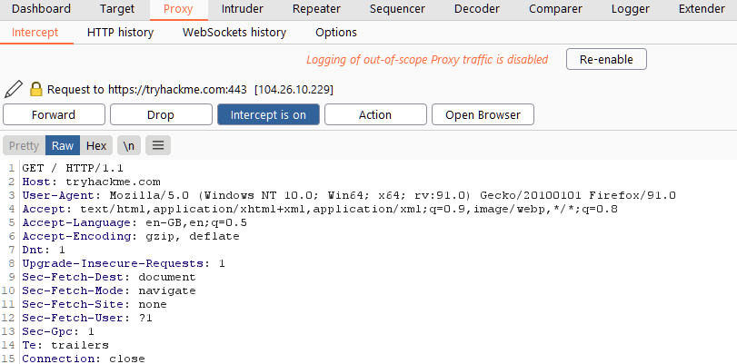
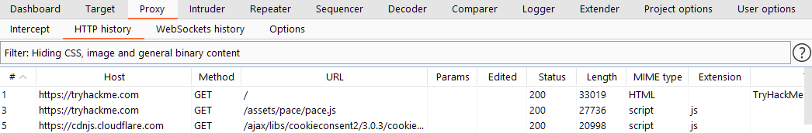
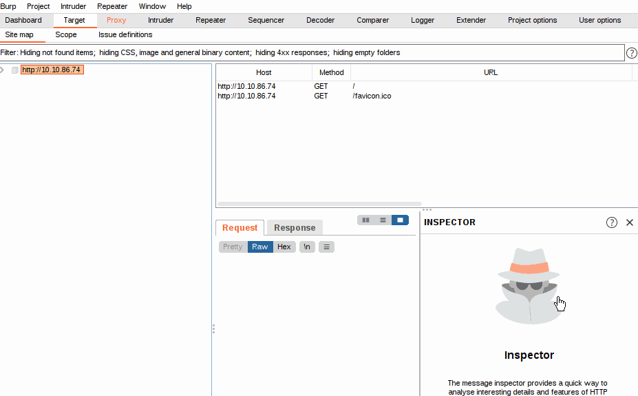
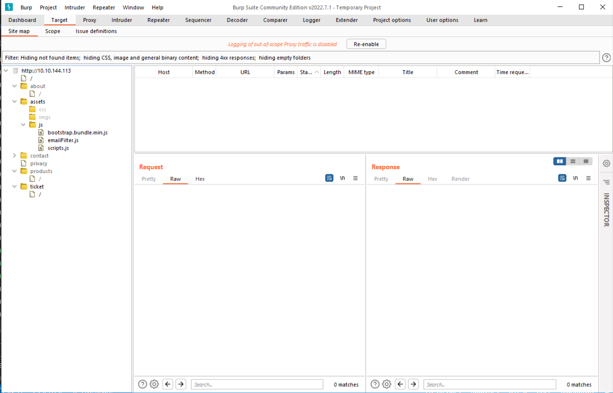
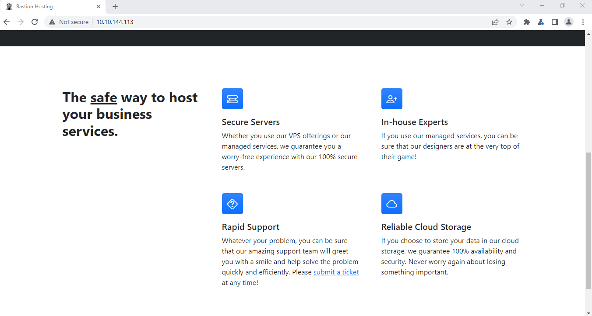
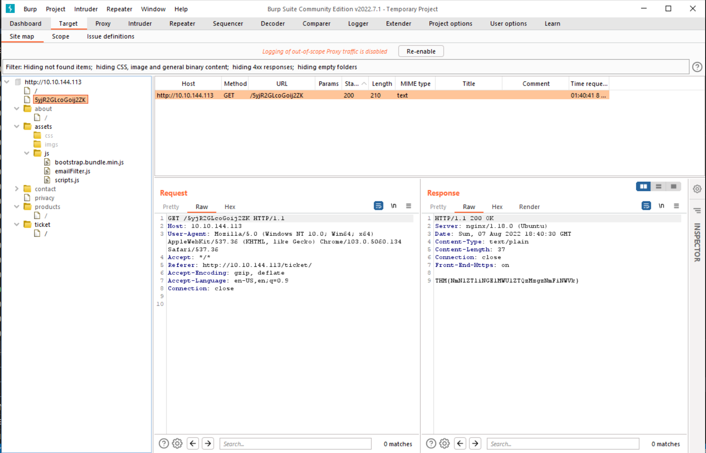
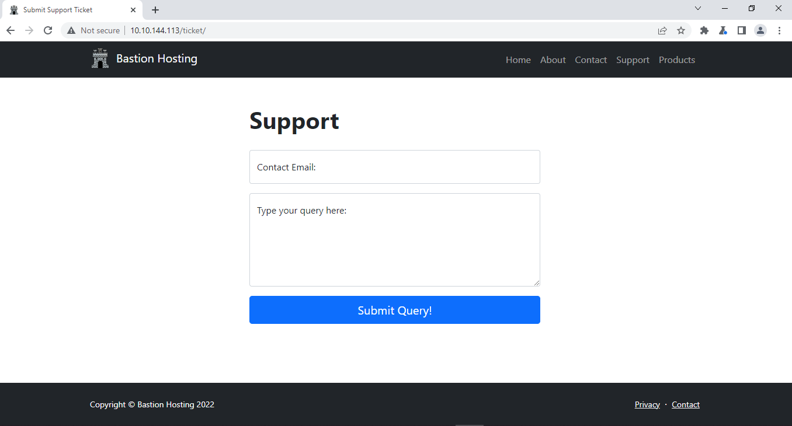
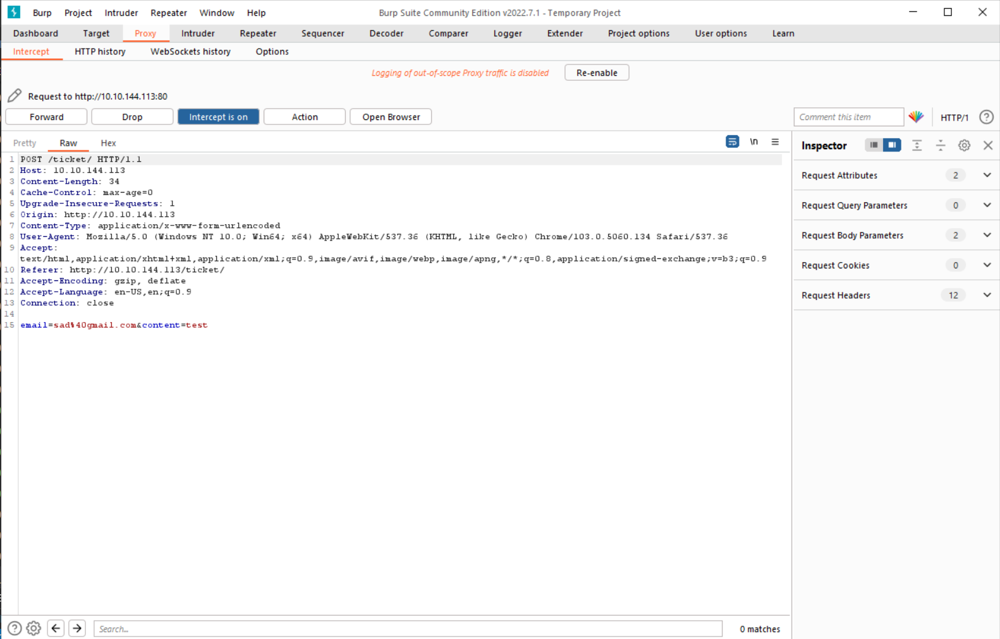
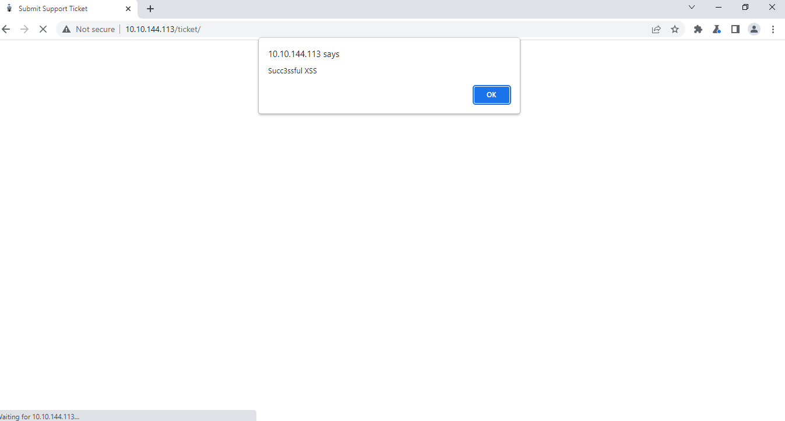

# 03_02_Burp Suite: The Basic

## Apa itu Burp Suite ?
Burp Suite adalah sebuah framework yang ditulis dalam Java yang bertujuan untuk menyediakan one-stop-shop untuk pengujian penetrasi aplikasi web. Burp Suite sangat umum digunakan saat mengetest aplikasi mobile, karena fiturnya yang efektif untuk menguji API yang menggerakkan sebagian besar aplikasi seluler.

Pada tingkat yang paling sederhana, Burp dapat menangkap dan memanipulasi semua lalu lintas antara penyerang dan server web, ini adalah inti dari framework ini. Setelah menangkap **request**, kita dapat memilih untuk mengirimnya ke berbagai bagian lain dari kerangka Burp Suite. Kemampuan untuk mencegat, melihat, dan memodifikasi permintaan web sebelum dikirim ke server target (atau, dalam beberapa kasus, tanggapan sebelum diterima oleh browser kami), menjadikan Burp Suite sempurna untuk segala jenis pengujian aplikasi web manual.

## Apa saja fungsi Burp Suite ?
### Proxy
Proxy memungkinkan kita untuk mencegat dan memodifikasi permintaan/tanggapan saat berinteraksi dengan aplikasi web.
### Repeater
Repeater memungkinkan kita untuk menangkap, memodifikasi, lalu mengirim ulang permintaan yang sama berkali-kali. Fitur ini bisa sangat berguna, terutama ketika kita perlu membuat payload melalui trial and error atau saat menguji fungsionalitas endpoint untuk mencari kekurangannya.
### Intruder
Intruder memungkinkan kita untuk menyerang endpoint dengan permintaan. Ini sering digunakan untuk serangan bruteforce.
### Decoder
Decoder memberikan layanan saat mengubah data baik dalam hal decoding informasi yang ditangkap, atau encoding payload sebelum mengirimkannya ke target. Meskipun ada layanan lain yang tersedia untuk melakukan pekerjaan yang sama, melakukan ini secara langsung di dalam Burp Suite bisa sangat efisien.
### Comparer
Pembanding memungkinkan kita untuk membandingkan dua bagian data pada tingkat kata atau byte.
### Sequencer
Sequencer biasanya digunakan saat menilai keacakan token seperti nilai cookie session atau data yang dihasilkan secara acak lainnya. Jika algoritme tidak menghasilkan nilai acak yang aman, maka ini dapat membuka beberapa jalan serangan.

## Burp Proxy
Burp Proxy adalah alat yang paling mendasar dan paling penting yang tersedia di Burp Suite. Hal ini memungkinkan kita untuk menangkap permintaan dan tanggapan antara diri kita sendiri dan target kita. Kemudian, permintaan tersebut dapat dimanipulasi atau dikirim ke alat lain untuk diproses lebih lanjut sebelum diizinkan untuk melanjutkan ke tujuan mereka.

Misalnya, jika kita membuat permintaan ke https://tryhackme.com melalui Burp Proxy, permintaan kita akan ditangkap dan tidak akan diizinkan untuk melanjutkan ke server TryHackMe sampai kita secara eksplisit mengizinkannya. Kita dapat memilih untuk melakukan hal yang sama dengan respon dari server, meskipun ini tidak aktif secara default. Kemampuan untuk mencegat permintaan ini pada akhirnya berarti bahwa kita dapat mengambil kendali penuh atas lalu lintas web kami kemampuan yang sangat berharga dalam hal menguji aplikasi web.

Dengan proxy aktif, sebuah **request** akan dibuat ke situs web TryHackMe. Pada titik ini, browser yang membuat permintaan akan hang, dan permintaan akan muncul di tab Proxy memberi kita tampilan yang ditunjukkan pada tangkapan layar di atas. Kita kemudian dapat memilih untuk meneruskan atau membatalkan permintaan. Kita juga dapat melakukan berbagai hal lain di sini, seperti mengirim permintaan ke salah satu modul Burp lainnya, menyalinnya sebagai perintah cURL, menyimpannya ke file, dan banyak lainnya.

Setelah selesai bekerja dengan Proxy, kita dapat mengklik tombol "Intercept is on" untuk menonaktifkan Intercept, yang akan memungkinkan permintaan melewati proxy tanpa dihentikan. Log dapat dilihat dengan membuka sub-tab "HTTP History" dan "WebSockets History".

## Scoping
Scoping memungkinkan kita untuk menentukan apa saja yang diproksi dan dicatat. Kita dapat membatasi Burp Suite untuk hanya menargetkan aplikasi web yang ingin di uji. Cara termudah untuk melakukannya adalah dengan beralih ke tab "Target", klik kanan target dari daftar di sebelah kiri, lalu pilih "Add to Scope". Burp kemudian akan menanyakan apakah kita ingin berhenti mencatat apa pun yang tidak ada dalam cakupan.

Ada tiga sub-tab di bawah Target :
- **Site Map** memungkinkan kita memetakan aplikasi yang ditargetkan dalam struktur tree. Setiap halaman yang kita kunjungi akan muncul di sini, memungkinkan kita untuk membuat peta situs secara otomatis hanya dengan menjelajahi aplikasi web. Peta Situs dapat sangat berguna jika kita ingin memetakan API, karena setiap kali kita mengunjungi halaman, titik akhir API tempat halaman tersebut mengambil data saat memuat akan muncul di sini.

- **Scope** memungkinkan kita untuk mengontrol lingkup target Burp untuk proyek tersebut.

- **Issue Definition** memberi kita daftar besar kerentanan web (lengkap dengan deskripsi dan referensi) yang dapat kita ambil jika kita memerlukan kutipan untuk laporan atau bantuan yang menjelaskan kerentanan.

## Praktek 1
Kita diminta untuk mencari sebuah flag di web bernama **Bastion Hosting** menggunakan sitemap. Pertama-tama kita buka sitemapnya. Tidak ada yang mencolok pada saat kita buka sitemap pertama kali.

Kedua kita coba klik tulisan **"submit a ticket"** dengan syarat "Intercept is on" pada bagian tab **Proxy**. Setelah didapatkan hasilnya, tekan tombol **"Forward"**.

Setelah itu, cek kembali pada tab **"Target"** bagian sitemap dan cek apakah ada perubahan. Bisa dilihat ada bagian baru yang mencolok, cek bagian response dan temukan flagnya.

## Praktik 2
Kita diminta untuk mengetik "" ke bagian *contact email* pada `http://IP/ticket/`. 

Pertama-tama, kita masukkan terlebih dahulu email yang valid ke bagian contact email dan querynya. Lalu klik tombol submit query dengan syarat "Intercept is on" pada bagian tab **Proxy**.

Ganti emailnya dengan "", lalu tekan forward. Maka akan muncul tulisan "Succ3ssful XSS".

